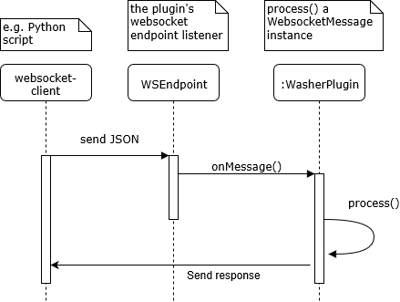

Design
======

.. currentmodule:: washer

Message flow from client
------------------------

The Python websocket client transmits a JSON document to the Java plugin
endpoint, where it is deserialised and processed. The server will reply,
also in JSON:

Message flow from server
------------------------

TODO: needs a diagram